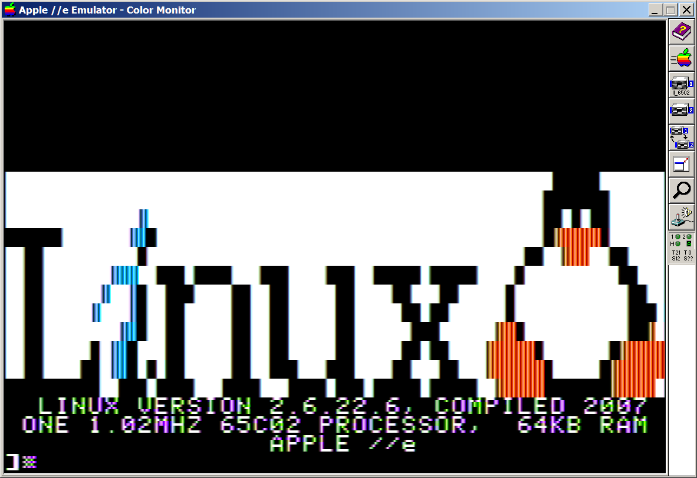
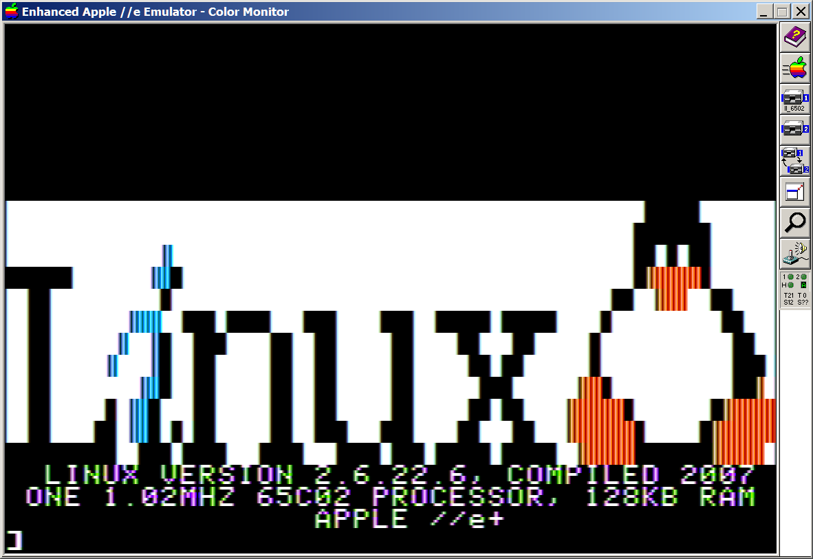

# 6502 Linux Logo

![Apple \]\[+](pics/linux_logo_2.png)
![Apple \]\[ ](pics/linux_logo_2plus.png)



Linux Logo in 6502 assembly language.

Size: 696 ($2B8) bytes

Features:

* Detects Apple \]\[, \]\[+, //e, //e+, //c, //c+
* Detects 48K/64K/128K 
* Cleaned up fugly logo by Albert Lai
  * Width is now 70 chars to be exact 4 pixels/char for 280 HGR resolution
  * Bit-packed Logo takes up 210 bytes (2 bits/char) compared to 80*12 = 960 byte
  * X is now symmetrical
  * Fixed L,i,n kerning
  * Fixed x Penguin kerning
  * Fixed L to fit
  * Chopped off 2 columns of penguin to fit 70 chars
* Expands 2 bits to 4 bits = 2 pixels (70 chars * 4 bits = 280 px)

```
__________________________________________________________@@@@@_______
_________________________________________________________@@@@@@@______
______________A__________________________________________@@_@_@@______
@@@@@@_______AA@_________________________________________@BBBBB@______
__@@__________@________________________________________@@__BBB__@@____
__@@_______AAA__@@@_@@@@___@@@____@@@__@@@@@_@@@@@____@__________@@___
__@@______A__A@__@@@____@@__@@_____@@____@@___@@_____@____________@@__
__@@_____A___A@__@@_____@@__@@_____@@_____@@_@@______@____________@@@_
__@@________AA@__@@_____@@__@@_____@@______@@@______BB@___________@@B_
__@@_____@_AA@___@@_____@@__@@_____@@_____@@_@@____BBBBB@_______@BBBBB
__@@____@@_AA@_@_@@_____@@__@@@___@@@____@@___@@___BBBBBB@_____@BBBBBB
@@@@@@@@@@__@@@_@@@@___@@@@___@@@@_@@@_@@@@@_@@@@@__BBBBB@@@@@@@BBBBB_
```

See: [ascii2hgr2bit](ascii2hgr2bit.c) for packing ASCII to 2 bits/char.
NOTE: PackedLen isn't needed if full 40 bytes HGR width is unpacked to.

Inspired from non-optimized version. Size: 1,573 ($625) bytes
* https://github.com/deater/linux_logo

