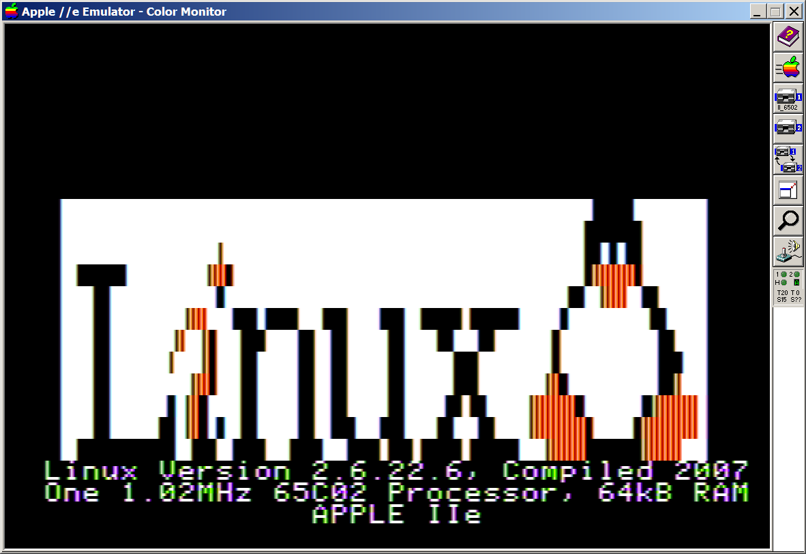

# 6502 Linux Logo

Optimized Linux Logo in 6502 assembly language for size.

Size: 664 ($298) bytes


# Screenshots

![Apple \]\[ ](pics/linux_logo_2.png)
![Apple \]\[+](pics/linux_logo_2plus.png)


# Features

* Detects Apple \]\[, \]\[+, //e, //e+, //c, //c+
  * Pretty-print model instead of generic `II` (bloats the code slightly but worth it.)
* Detects 48K/64K/128K 
* System information in all uppercase (for Apple \]\[ without lowercase)
* Cleaned up fugly logo by Albert Lai
  * Logo is now 70 chars wide
  * Logo is bit packed 2 bits/char; expands 70 chars * 4 px = 280 px
  * Logo takes up 70\*12\*2/8 = 210 bytes compared to 79*12 = 948 bytes
  * X is now symmetrical
  * Fixed L,i,n kerning
  * Fixed x Penguin kerning
  * Fixed L to fit
  * Chopped off 2 columns of penguin to fit 70 chars
  * Red 'i' is now a beautiful blue to break up the monotomy of all orange

```
..........................................................#####.......
.........................................................#######......
...............@.........................................## # ##......
######........@@#........................................#QQQQQ#......
..##...........#.......................................##..QQQ..##....
..##.......@@@..###.####...###....###..#####.#####....#..........##...
..##......@..@#..###....##..##.....##....##...##.....#............##..
..##.....@...@#..##.....##..##.....##.....##.##......#............###.
..##........@@#..##.....##..##.....##......###......QQ#...........##Q.
..##.....#.@@#...##.....##..##.....##.....##.##....QQQQQ#.......#QQQQQ
..##....##.@@#.#.##.....##..###...###....##...##...QQQQQQ#.....#QQQQQQ
##########..###.####...####...####.###.#####.#####..QQQQQ#######QQQQQ.
```

See: [ascii2hgr2bit.c](ascii2hgr2bit.c) for packing ASCII to 2 bits/char.
NOTE: PackedLen isn't needed if full 40 bytes HGR width is unpacked to.

Inspired from non-optimized version. Size: 1,573 ($625) bytes
* https://github.com/deater/linux_logo

Note: Lowercase doesn't display properly on \]\[.

![Apple \]\[+](pics/ll_6502_2plus.png)


The 79x12 logo that was used as the basis for the logo cleanup:


# License

[WTFPL](http://www.wtfpl.net/)

If you use code, please provide a comment link so people can follow it for updates.

# Tools used

* [Merlin32](brutaldeluxe.fr/products/crossdevtools/merlin/)

# Credits

* qkumba for his excellent optimization tips and tricks
* Mike B. for Text to HGR Page 1 optimization
